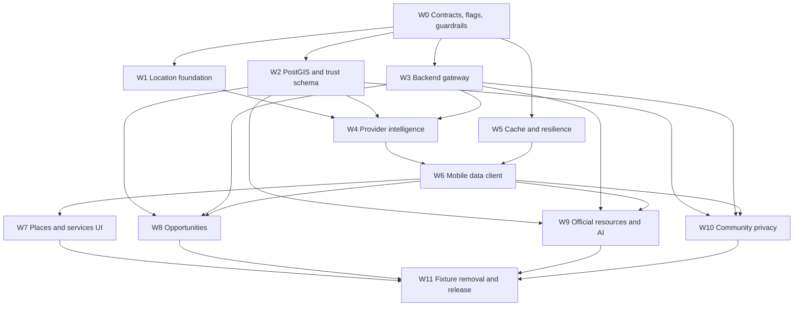

# Naero Real Data Execution Plan

**Plan date:** 2026-07-25  
**Input:** Accepted `docs/REAL_DATA_AUDIT.md`  
**Scope:** Implementation roadmap only — no production code is introduced by this document  
**Coverage:** All 73 audit findings, assigned once to a primary workstream

## Outcome

This roadmap replaces Naero's mock-first, Hungary-centric data paths with one location-aware production architecture while preserving the existing design, navigation, authentication, Google Sign-In, Facebook code, localization, RTL behavior, and working product flows.

The implementation is ordered around shared contracts and irreversible boundaries rather than screens. Data contracts, flags, location state, database foundations, and the backend gateway are established before provider integrations or UI cutovers. Fixtures are removed only after real, empty, error, stale, and offline states pass their gates.

## Planning principles

1. **One contract, one implementation.** Nearby places, services, opportunities, legal resources, and community discovery each receive one canonical backend contract and one mobile client path.
2. **No screen-specific providers.** Screens consume normalized domain services; they never call Google, OSM, Nominatim, or Supabase directly.
3. **Expand, migrate, contract.** Database and API changes add compatible structures first, migrate/read-verify second, and remove legacy structures only after rollback windows close.
4. **Real, stale-real, empty, or error.** Provider failure never becomes demo content.
5. **Feature flags control behavior, not schema safety.** Flags can route traffic or hide incomplete UI, but migrations must remain safe if flags are misconfigured.
6. **Location privacy precedes location discovery.** Exact coordinates are transient request inputs unless explicitly required; community visibility is separate, approximate, and opt-in.
7. **Source metadata travels end to end.** Provider/source ID, attribution, freshness, verification, jurisdiction, and expiry survive normalization, caching, API serialization, mobile storage, and display.
8. **Old artifacts are treated as data.** Source cleanup is incomplete until generated bundles and APKs are rebuilt and scanned.

## Complexity and risk scale

- **Complexity:** S (up to a few focused changes), M (multi-file subsystem), L (cross-layer feature), XL (schema/API/product migration).
- **Risk:** Low, Medium, High, Critical.
- Estimates are relative engineering complexity, not calendar commitments.

## Workstream map and finding ownership

| Order | Workstream | Primary audit findings | Complexity | Risk | Execution mode |
|---:|---|---|---|---|---|
| 0 | Contracts, flags, and observability guardrails | DATA-07, DATA-10, MODEL-01, MODEL-02, MODEL-03, CFG-02 | L | High | Sequential foundation |
| 1 | Single mobile location foundation | UI-12, UI-14, DATA-09, SVC-07, SVC-08, SVC-09, SVC-10, SVC-16 | L | High | Sequential foundation |
| 2 | PostGIS, provenance, and trust schema | DB-01, DB-02, DB-03, DB-04 | XL | Critical | Sequential foundation |
| 3 | Secure backend gateway and API contract | BE-01, BE-02, CFG-03 | L | Critical | Sequential foundation |
| 4 | Provider adapters and location intelligence | SVC-03, SVC-11, SVC-12, SVC-13, SVC-14, BE-03 | XL | High | Sequential core; adapters parallelizable |
| 5 | Cache, offline, and resilience | SVC-15 | L | High | Parallel after contracts; joins before UI |
| 6 | Mobile real-data client and fallback removal | SVC-01, SVC-02, SVC-04, SVC-05 | XL | Critical | Sequential cutover layer |
| 7 | Nearby places and verified services UI integration | UI-01, UI-03, UI-04, UI-05, UI-10, UI-11, DATA-01, DATA-02 | XL | High | Parallel by screen after shared client |
| 8 | Opportunities: jobs and housing | UI-06, DATA-03, DATA-04, MODEL-04 | XL | Critical | Parallel domain after DB/API foundation |
| 9 | Official resources, safety, and AI grounding | UI-09, UI-15, DATA-06, AI-01, AI-02, AI-03, AI-04, AI-05, AI-06, AI-07, AI-08, AI-09, AI-10, BE-04 | XL | Critical | Sequential ingestion then AI cutover |
| 10 | Community data and privacy-preserving discovery | UI-02, UI-07, UI-08, DATA-05, SVC-06, MODEL-05, DB-05, UI-13, UI-16 | XL | Critical | Sequential privacy/schema before UI |
| 11 | Fixture quarantine, encoding cleanup, and release artifacts | DATA-08, DATA-11, DB-06, DB-07, CFG-01, CFG-04 | M | High | Final contraction and release |

**Coverage rule:** An audit finding appears in exactly one “Primary audit findings” cell. Other workstreams may depend on its solution but do not re-own it.

## Dependency graph

## Workstream 0 — Contracts, feature flags, and guardrails

**Objective:** Freeze shared normalized types, category taxonomy, API envelopes, error/freshness semantics, environment ownership, and rollout flags before any storage, provider, or UI implementation.

**Dependencies:** Accepted audit only. This workstream is the prerequisite for all others.

**Estimated complexity:** L  
**Risk level:** High — a weak contract would cause every later layer to be rewritten.

**Files likely affected:**

- new shared contract/schema modules under `backend/src/domain/` and `src/data/models/` or a dependency-free shared package;
- `src/data/schema.js`, `src/data/categories.js`, `src/data/providers/mockCategories.js`;
- `.env.example`, `backend/.env.example`, `backend/.env.development.example`, `backend/.env.staging.example`, `backend/.env.production.example`;
- `src/config/api.js`, `backend/src/config/env.js`;
- new decision records under `docs/`.

**Backend changes:**

- Define normalized DTOs for `LocationSnapshot`, `NearbyResult`, `Opportunity`, `OfficialResource`, and privacy-safe `CommunityNearbyResult`.
- Define a stable error envelope with request ID, code, retryability, partial/stale indicators, and no sensitive query echo.
- Create one canonical category registry with provider mapping slots and localization keys.
- Add structured, privacy-redacted metrics for provider outcome, latency, cache status, result count, and fallback chain.

**Mobile changes:**

- Replace model defaults that invent Hungary or rating `0` with nullable explicit fields.
- Add response decoders/validators so invalid or incomplete server data fails safely.
- Preserve localized labels in i18n; use category IDs from the shared registry.

**Database changes:** None beyond drafting names, enums/check constraints, and compatibility rules for Workstream 2.

**API changes:**

- Freeze `/api/v1` naming, pagination/limits, coordinate/radius units, source metadata, `null` behavior, stale metadata, and versioning policy.
- Decide compatibility aliases for existing `/v1` clients; do not implement two business-logic stacks.

**QA requirements:**

- Contract fixture tests for null fields, unknown categories, partial results, Arabic/French/Hungarian Unicode, and backward-compatible decoding.
- Automated comparison proving backend and mobile category/type definitions cannot drift.
- Environment test proving provider secrets are rejected from Expo public configuration.

**Rollback strategy:** Contracts are additive until consumers exist. Revert new modules/flags without data migration. Retain the existing app path while all real-data flags are off.

**Feature flags introduced:**

- `REAL_DATA_MASTER_ENABLED`
- `LOCATION_FOUNDATION_V2_ENABLED`
- `NEARBY_API_V1_ENABLED`
- `REAL_PLACES_ENABLED`
- `REAL_SERVICES_ENABLED`
- `REAL_OPPORTUNITIES_ENABLED`
- `OFFICIAL_RESOURCES_ENABLED`
- `AI_VERIFIED_CONTEXT_ONLY`
- `COMMUNITY_LOCATION_DISCOVERY_ENABLED`
- `PERSISTENT_REAL_DATA_CACHE_ENABLED`

Flags should support server-side global control and mobile remote-config/config-endpoint consumption. Defaults remain off until the owning workstream passes its gate.

## Workstream 1 — Single mobile location foundation

**Objective:** Create one non-blocking application location source supporting foreground GPS and validated manual city mode without any geographic default.

**Dependencies:** Workstream 0 contracts and flags.

**Estimated complexity:** L  
**Risk level:** High — location state affects every later query and privacy promise.

**Files likely affected:**

- `src/services/locationService.js`;
- `src/context/AppContext.js` or a new dedicated location context/store;
- `src/screens/LocationPermissionScreen.js`;
- location portions of `src/screens/ProfileScreen.js` and `src/screens/SettingsScreen.js`;
- `src/utils/geo.js`;
- `src/services/realTimeService.js`;
- i18n files `src/i18n/{en,ar,fr,hu}.json`;
- focused location/cache tests.

**Backend changes:** Only consume the reverse-geocode/manual-city API contract once Workstream 3 is available; no provider call from mobile.

**Mobile changes:**

- Store latitude, longitude, accuracy, captured timestamp, source mode, freshness, and normalized administrative fields.
- Request foreground permission only and distinguish denied, disabled, unavailable, timeout, approximate, and manual modes.
- Add significant-change thresholds to prevent unnecessary refreshes.
- Add geocoder-backed manual city selection, “prefer manual city,” disable location use, refresh, and clear-all controls.
- Remove Budapest/Hungary fallbacks and priority-city nearest matching.
- Make all screens read the same state; no independent GPS requests.

**Database changes:** None. Device location stays local in this workstream.

**API changes:** Consume `GET /api/v1/location/reverse-geocode` and a city-search endpoint defined in Workstream 3. Exact coordinates are request-scoped and not logged.

**QA requirements:**

- Permission allowed/denied, GPS disabled, approximate accuracy, lookup failure, timeout, manual city, preference switching, clear, significant movement, and no movement.
- Budapest, Győr, Vienna, Tunis, Paris, Berlin, and rural coordinates.
- English, Arabic RTL, French, Hungarian; no corrupted city names.
- App remains usable with no location.

**Rollback strategy:** Keep the existing location state adapter behind `LOCATION_FOUNDATION_V2_ENABLED`. New storage keys must be namespaced; disabling the flag restores old reads without deleting new data. No database rollback is needed.

**Primary gate:** A location snapshot must never contain an inferred city/country and must clear all stored fields on user request.

## Workstream 2 — PostGIS, provenance, and trust schema

**Objective:** Add production-safe geospatial and provenance storage before backend queries or domain ingestion depend on it.

**Dependencies:** Workstream 0 contracts. Can proceed in parallel with Workstream 1.

**Estimated complexity:** XL  
**Risk level:** Critical — schema/RLS mistakes can expose location or elevate unverified data.

**Files likely affected:**

- new reversible migrations after `backend/db/migrations/004_rag_knowledge.sql`;
- `backend/db/MIGRATIONS.md`, `backend/db/DATABASE.md`;
- repository modules under `backend/src/services/repositories/`;
- database verification scripts and RLS tests.

**Backend changes:**

- Add repositories/RPC callers only after schema functions are tested.
- Enforce service-role writes for provider cache and verification log.
- Make verified/active filters the default for public reads and AI retrieval.

**Mobile changes:** None directly.

**Database changes:**

- Enable PostGIS safely.
- Add explicit `country_code`; remove reliance on `country default 'Hungary'`.
- Add `geography(Point,4326)` fields and GiST indexes using expand/backfill/verify/contract.
- Add service categories, verified services/locations, opportunities/locations, legal resources, provider cache, verification log, and preference tables needed by later workstreams.
- Add nearby verified-service/opportunity RPCs with radius limits and distance ordering.
- Separate submitted/unverified content from approved public results.
- Add strict RLS and service-role policies; never expose community exact coordinates.

**API changes:** None public yet. Database function signatures follow Workstream 0 units and result shapes.

**QA requirements:**

- Migration up/down rehearsal on a production-like copy.
- Invalid/null/out-of-range coordinate backfill tests.
- Spatial index usage via `EXPLAIN`.
- Cross-user, anonymous, authenticated, moderator, and service-role RLS tests.
- Verify public queries exclude submitted, inactive, expired, or unverified records.
- Verify no implicit Hungary is introduced.

**Rollback strategy:**

- Expand phase adds columns/tables/functions without dropping legacy columns.
- Backfill in bounded batches with before/after counts and rejects table/report.
- Application reads remain on legacy path until flags switch.
- Rollback disables new functions/flags and drops only new objects if no new writes must be preserved.
- Contract/drop legacy columns occurs only after at least one stable release and is a separate approved migration.

**Feature flag:** Database objects are deployed dark; application access requires domain flags.

## Workstream 3 — Secure backend gateway and API contract

**Objective:** Make the Node backend the only mobile gateway for sensitive/paid providers and provide one validated, versioned surface for later domains.

**Dependencies:** Workstream 0. Stubbed endpoints can start before Workstream 2, but real repository handlers cannot launch before the schema gate.

**Estimated complexity:** L  
**Risk level:** Critical — security, cost, availability, and compatibility converge here.

**Files likely affected:**

- `backend/src/server.js`;
- new `backend/src/routes/location.js`, `nearby.js`, `places.js`, `services.js`, `opportunities.js`, `community.js`, and resource routes;
- new validation/rate-limit/timeout middleware;
- `backend/src/observability/logger.js`, `monitoring.js`;
- `src/config/api.js`, `src/services/api/naeroApi.js`, `src/services/placeService.js`;
- `src/ai/geminiClient.js`, `src/ai/config.js`;
- backend environment templates and tests.

**Backend changes:**

- Add `/api/v1` routing with compatibility forwarding from required `/v1` paths to the same handlers.
- Validate coordinates, radius, category, language, pagination, IDs, and limits.
- Add timeouts, bounded retries, rate limiting, request IDs, structured errors, and redacted request logs.
- Keep provider keys in backend environment only.
- Add health/readiness signals that distinguish app health from provider health.

**Mobile changes:**

- Point new clients at the gateway.
- Remove direct mobile AI/provider-secret configuration once backend parity is proven.

**Database changes:** Read-only use of Workstream 2 repositories; no new schema owned here.

**API changes:**

- `GET /api/v1/location/reverse-geocode`
- city search endpoint under `/api/v1/location/`
- `GET /api/v1/nearby`
- `GET /api/v1/places/:id`
- `GET /api/v1/services/nearby`
- `GET /api/v1/opportunities/nearby`
- `GET /api/v1/community/nearby`
- official resource endpoints needed by Workstream 9

**QA requirements:**

- Boundary/fuzz tests for coordinates, radius, limit, IDs, category and language.
- 400/401/403/404/429/502/503/504 contract tests.
- Logs and traces must not contain raw coordinates, tokens, provider keys, addresses, or profile data.
- Verify old and new route aliases hit one implementation.
- Verify no OpenAI/Gemini/Google secret appears in mobile bundle or network request.

**Rollback strategy:** Routes are additive and dark behind `NEARBY_API_V1_ENABLED`. Disable routes/provider access while keeping the existing backend healthy. Compatibility forwarding can be removed independently after mobile adoption.

## Workstream 4 — Provider adapters and unified location intelligence

**Objective:** Implement provider-agnostic reverse geocoding and nearby discovery with precise categories, normalization, distance, ranking, filtering, deduplication, and attribution.

**Dependencies:** Workstreams 0, 1 contract output, 2, and 3. Provider adapters may be developed in parallel against contract fixtures.

**Estimated complexity:** XL  
**Risk level:** High — external policy, cost, geographic relevance, and deduplication errors are material.

**Files likely affected:**

- new backend location-intelligence service and provider interfaces;
- backend Google Places New, Overpass, Nominatim, and Naero/PostGIS adapters;
- `backend/src/services/repositories/placesRepository.js`;
- mobile direct adapters `src/services/api/googlePlacesApi.js`, `overpassApi.js`, `nominatimApi.js` only for deprecation/removal after cutover;
- `src/utils/distance.js`;
- `docs/DATA_ATTRIBUTION.md` in the later attribution stage;
- provider normalization/ranking tests.

**Backend changes:**

- Implement provider interface, normalized `NearbyResult`, strict null behavior, source attribution, fetch/check timestamps, and confidence.
- Google Places API New is primary when configured; OSM and Naero data complement/fallback according to category.
- Map all required categories to narrow provider types/tags.
- Calculate distance from coordinates or PostGIS; reject invalid/out-of-radius results.
- Deduplicate by provider ID, normalized Unicode name, coordinates, address, and bounded similarity.
- Filter permanently closed, irrelevant, invalid, expired, and duplicate results.
- Rank by distance, verification, category relevance, confidence, freshness, reliable open state, completeness, and language relevance.

**Mobile changes:** None beyond consuming normalized fixtures during development; direct adapters remain disabled once gateway flag is on.

**Database changes:** Use provider cache and verified location tables from Workstream 2; no parallel schema.

**API changes:** Populate the Workstream 3 endpoints without changing their frozen shape.

**QA requirements:**

- Unit tests for normalization, coordinate validation, Haversine/PostGIS parity, dedup thresholds, ranking, closure filtering, null fields, Unicode, and attribution.
- Provider timeout/failure/zero/dense/rural/partial-result tests.
- Geographic relevance assertions for all required test cities and rural location; assert coordinates, categories, radius, distance, and source, not only HTTP status.
- Provider terms/caching tests and Google field-mask tests.

**Rollback strategy:** Each provider has an independent server-side flag and circuit breaker. Disable a faulty adapter while retaining verified Naero/other provider results. The normalized API remains stable, preventing mobile rollback.

**Feature flags:**

- `GOOGLE_PLACES_PROVIDER_ENABLED`
- `OSM_OVERPASS_PROVIDER_ENABLED`
- `NOMINATIM_PROVIDER_ENABLED`
- `NAERO_VERIFIED_PROVIDER_ENABLED`
- per-category provider allowlists for gradual rollout

## Workstream 5 — Cache, offline, and resilience

**Objective:** Implement three cache layers with source-aware freshness, legal/provider retention rules, stale-real behavior, and reliable partial results.

**Dependencies:** Workstream 0 can start design; Workstreams 2–4 provide storage and provider semantics. Must complete before public UI cutover.

**Estimated complexity:** L  
**Risk level:** High — incorrect caching can violate terms or preserve expired/unsafe data.

**Files likely affected:**

- `src/services/cacheService.js`, `src/services/dataService.js`, `src/services/syncEngine.js`;
- backend provider cache repository/service;
- device cache schema/version migration;
- environment cache settings and cache tests.

**Backend changes:**

- Provider/category-specific TTL, negative-cache rules, timeout/retry/backoff, stale-while-revalidate where allowed, and stampede prevention.
- Never cache forbidden Google fields beyond permitted rules.
- Round reverse-geocode coordinates for cache keys without logging raw coordinates.
- Expiry is a hard boundary for opportunities; verification date is a boundary for legal resources.

**Mobile changes:**

- Cache only normalized real responses with source/fetched/expires metadata.
- Surface fresh, stale, offline, partial, and error states distinctly.
- Version cache entries and remove legacy mock caches on migration.

**Database changes:** Use `provider_cache`; apply retention cleanup jobs/functions without storing user query histories.

**API changes:** Return `fetchedAt`, freshness/stale indicators, partial provider errors, and retry hints defined in Workstream 0.

**QA requirements:**

- Memory/device/backend hit, miss, expiry, corruption, eviction, offline, clock-skew, stale, retry, and provider recovery tests.
- Verify expired jobs/housing never reappear from any cache.
- Verify mock records cannot be written to new caches.
- Verify deletion/clear actions clear relevant device location/result keys.

**Rollback strategy:** Disable `PERSISTENT_REAL_DATA_CACHE_ENABLED` and fall back to memory/no-cache provider requests. Versioned keys allow deletion of only the new cache namespace.

## Workstream 6 — Mobile real-data client and fake-fallback removal

**Objective:** Replace the shared mock-first `DataService`/Firestore compatibility path with one typed backend client that represents empty, stale, partial, offline, and error states honestly.

**Dependencies:** Workstreams 0, 3, 4, and 5. Must precede screen/domain cutovers.

**Estimated complexity:** XL  
**Risk level:** Critical — this is the behavioral cutover that stops silent fabrication.

**Files likely affected:**

- `src/services/dataService.js`;
- `src/services/placeService.js`, `serviceService.js`, `jobService.js`, `housingService.js`, `communityService.js`, `safetyService.js`, `searchService.js`;
- `src/firebase/firestore.js`, `src/firebase/config.js`;
- `src/services/api/naeroApi.js`, `src/services/api/index.js`;
- `src/context/AppContext.js`;
- shared loading/error/empty components.

**Backend changes:** None beyond correcting API defects found through client integration.

**Mobile changes:**

- Introduce typed repositories/domain services over the backend API.
- Remove constructor injection of mock arrays from production services.
- Stop synthetic Firestore reads/writes and success responses.
- Unify live and standard places into one state path.
- Make source/freshness/error explicit; never convert failure to local fixture data.
- Keep old service method adapters temporarily if they delegate to the new client, avoiding simultaneous screen rewrites.

**Database changes:** None.

**API changes:** Consume frozen APIs only; contract changes require version review, not ad hoc screen exceptions.

**QA requirements:**

- Provider/backend unavailable must yield error or stale-real data, never mock.
- Empty results, partial results, offline cache, malformed response, unauthorized, timeout, and retry.
- Search across domains and state refresh/location change.
- Static scan proving production service graph does not import `mock*`.

**Rollback strategy:** Route reads through `REAL_DATA_MASTER_ENABLED`; old path remains available only during internal rollout. The rollback path must display a maintenance/empty state rather than re-enable fabricated production cards. Once Workstream 11 deletes fixtures, rollback means disabling the affected domain, not restoring mocks.

## Workstream 7 — Nearby places and verified services UI integration

**Objective:** Connect Home, Discover/Explore, Services, and detail views to normalized real nearby data without redesigning them.

**Dependencies:** Workstreams 1, 4, 5, and 6.

**Estimated complexity:** XL  
**Risk level:** High.

**Files likely affected:**

- `src/screens/HomeScreen.js`, `DiscoverScreen.js`, `ExploreScreen.js`, `ServicesScreen.js`, `PlaceDetailScreen.js`, `ServiceDetailScreen.js`;
- `src/components/ListingCard.js`, `LoadingState.js`, `ErrorState.js`, `EmptyState.js`;
- category/localization files;
- place/service integration tests.

**Backend changes:** Tune category/ranking and detail endpoints based on QA evidence; no separate screen-specific endpoint.

**Mobile changes:**

- Replace Home `PLACES`; retain exact visual structure with real results.
- Remove client latitude-delta sorting and city-slice “nearby.”
- Display ratings/hours/phone/website only when non-null.
- Add verified/confidence/freshness and required attribution without fabricating fields.
- Use safe server-supplied navigation URL.
- Implement loading, empty, unavailable-location, partial, stale, offline, and error states.

**Database changes:** None.

**API changes:** No new APIs. All screens use shared nearby/service/detail endpoints.

**QA requirements:**

- Visual regression across English, Arabic RTL, French, Hungarian.
- Dense/rural/no-results/location-denied/manual-city/offline/provider-failure.
- Assert displayed name, category, coordinate relevance, server distance, source, null handling, and attribution.
- Verify no static distance, fake rating, phone, address, or hours remain.

**Rollback strategy:** Independent `REAL_PLACES_ENABLED` and `REAL_SERVICES_ENABLED` flags. Rollback shows honest unavailable/maintenance states using the existing layout; it does not restore fake cards.

**Parallelizable work:** Home, Discover/Explore, Services, and detail components can be assigned separately after the common client and fixtures are stable.

## Workstream 8 — Opportunities: jobs and housing

**Objective:** Create a compliant, expiring opportunity pipeline and connect jobs/housing only when source and availability requirements are met.

**Dependencies:** Workstreams 0, 2, 3, 5, and 6. Can run in parallel with Workstreams 7, 9, and 10 after foundations.

**Estimated complexity:** XL  
**Risk level:** Critical — stale or fabricated opportunities can cause financial and immigration harm.

**Files likely affected:**

- opportunity tables/migrations and repositories;
- new backend opportunity provider interface/routes;
- `src/services/jobService.js`, `housingService.js`, `searchService.js`;
- `src/screens/JobsScreen.js`, `JobDetailScreen.js`;
- housing UI only where an existing flow is present; no redesign/new navigation without separate approval;
- opportunity tests and provider setup documentation.

**Backend changes:**

- Provider interface for official APIs, licensed feeds, trusted partners, and manually verified Naero records.
- Require original source/URL, organization, city, coordinates where available, publication/expiry/checked dates, active state, language, type, application URL, and confidence.
- Automatic expiry and “availability not confirmed” state.
- Respect source terms; no unapproved scraping.

**Mobile changes:**

- Render only active or honestly unconfirmed records.
- Replace relative fabricated posted dates with source dates.
- Preserve saved-item behavior against stable production IDs.
- Provide honest empty/error/offline states.

**Database changes:** Use opportunity and location tables from Workstream 2; add only domain-specific constraints/indexes that the frozen schema intentionally deferred.

**API changes:** Implement nearby/list/detail opportunity endpoints using the shared envelope and normalized model.

**QA requirements:**

- Expired, missing-expiry, withdrawn, duplicated, stale-cache, no-coordinate, bad application URL, and source outage tests.
- Geographic and language relevance across required cities.
- Verify source URL, checked date, status, type, and confidence in every result.
- Terms/license review recorded per provider.

**Rollback strategy:** Disable individual provider feeds or `REAL_OPPORTUNITIES_ENABLED`; retain saved IDs but show listing unavailable. Never fall back to demo jobs/housing.

## Workstream 9 — Official resources, safety, and AI grounding

**Objective:** Replace uncited static legal/immigration/safety knowledge with verified official/trusted resources, then constrain AI to source-aware explanations and translations.

**Dependencies:** Workstreams 0, 2, 3, 5, and 6. Resource ingestion must pass before AI is switched to verified-only mode.

**Estimated complexity:** XL  
**Risk level:** Critical.

**Files likely affected:**

- legal-resource migrations/repositories/routes and verification workflow;
- `backend/knowledge/*.md`;
- `backend/src/services/ai/knowledge/{index,sources,retrieval,assembly}.js`;
- `backend/src/services/ai/prompts/templates.js`;
- `backend/src/services/ai/tools/places.js`;
- `src/ai/engine.js`, `src/ai/knowledge.js`, `src/ai/geminiClient.js`;
- `src/screens/AIScreen.js`, `SafetyScreen.js`;
- resource attribution and QA documentation.

**Backend changes:**

- Ingest structured official/trusted resources with jurisdiction, topic, original URL, language, effective/checked dates, verification status, reviewer, and translations.
- Separate official data, trusted NGO data, UGC, and general model output.
- Remove Hungary defaults from prompt/RAG context.
- AI responses cite source and checked date, state uncertainty, and refuse to fabricate missing deadlines/procedures/authorities.
- AI place tool uses normalized verified nearby service, not raw public `places`.

**Mobile changes:**

- Remove local factual AI fallback and direct Gemini path after backend parity.
- Show source, trust label, checked date, and “information may have changed.”
- Safety view becomes jurisdiction-aware and never shows uncited contacts.

**Database changes:** Use `legal_resources` and verification log from Workstream 2 with review-state and translation relations/fields.

**API changes:** Official resource list/detail/search endpoints and AI context references; no raw knowledge-document exposure.

**QA requirements:**

- Metadata completeness and official-domain/source validation.
- Known stale/outdated fixtures must be rejected.
- AI citation linkage, last-checked display, unsupported-jurisdiction refusal, translation fidelity, and no invented claims.
- Adversarial prompts asking for exact legal deadlines or authorities absent from sources.
- English, Arabic RTL, French, Hungarian.

**Rollback strategy:** Disable `OFFICIAL_RESOURCES_ENABLED` for resource UI and set AI to a safe general assistant with no local factual claims. `AI_VERIFIED_CONTEXT_ONLY` should fail closed: unavailable verified context produces a limitation message, not old local knowledge.

## Workstream 10 — Community data and privacy-preserving discovery

**Objective:** Replace fake community activity and local success stubs with real moderated UGC, then add separate opt-in approximate nearby discovery with strict privacy controls.

**Dependencies:** Workstreams 0, 2, 3, and 6. Community location schema/RLS must pass before any discovery UI is enabled.

**Estimated complexity:** XL  
**Risk level:** Critical.

**Files likely affected:**

- community location/preference migrations, RPCs, RLS, repositories, and routes;
- `src/services/communityService.js`;
- `src/screens/HomeScreen.js`, `CommunityScreen.js`, `CommunityDetailScreen.js`, `ProfileScreen.js`, `SettingsScreen.js`, `NotificationsScreen.js`;
- `src/data/models/Community.js`, `UserProfile.js`;
- community abuse/block/moderation code and tests;
- privacy/security documentation.

**Backend changes:**

- Durable authenticated posts/comments/likes with authorization, idempotency, moderation, reports, block filtering, and deletion.
- Separate discovery opt-in, off by default; approximate location only where possible.
- Return city, safe district, and distance buckets only; never exact coordinates or home address.
- Pause/resume visibility and delete-all-location endpoints.
- Ensure notifications reference normalized record IDs and contain no exact coordinates.

**Mobile changes:**

- Remove Home `PEOPLE` and fake community feed.
- Explain what is shared before opt-in.
- Add visibility pause, deletion, block/report, and privacy-safe distance presentation.
- Correct location privacy copy to disclose backend/provider processing and retention.

**Database changes:**

- Implement community/user location preferences, approximate representation, deletion timestamps, and strict RLS using Workstream 2 foundations.
- Avoid storing request-time exact GPS where an approximate city/district/geohash surrogate suffices.

**API changes:** Privacy-safe community nearby and preference/deletion endpoints; authenticated UGC mutation endpoints.

**QA requirements:**

- Off by default and no silent enrollment of existing users.
- Cross-user RLS, blocked-user exclusion, paused/deleted visibility, abuse/report flows, exact-coordinate non-disclosure, bucket-boundary tests, small/rural cohort safety.
- Verify logs, notifications, caches, and API errors contain no exact coordinates.
- Durable post/comment/like failure and retry behavior.

**Rollback strategy:** `COMMUNITY_LOCATION_DISCOVERY_ENABLED` defaults off and can be disabled independently while regular community remains. Rollback pauses discovery responses server-side; stored approximate data remains deletable. UGC rollback disables writes with a clear read-only state, not synthetic success.

## Workstream 11 — Fixture quarantine, encoding cleanup, and release artifacts

**Objective:** Remove production reachability of all mock/legacy data, prevent seed contamination, repair Unicode ingestion, and rebuild clean Android artifacts after every domain passes.

**Dependencies:** Workstreams 7–10 complete and stable. Some quick-win guardrails may land earlier, but deletion is deliberately last.

**Estimated complexity:** M  
**Risk level:** High — premature deletion harms rollback; late cleanup leaves fake data in bundles.

**Files likely affected:**

- `src/data/providers/mock*.js`, legacy `src/data/*.js`;
- production import lint rules/tests;
- `backend/db/seeds/001_sample_places.sql`, `backend/db/seeds/README.md`;
- encoding validation scripts/tests;
- `android/app/src/main/assets/index.android.bundle`;
- build/release reports and APK output.

**Backend changes:**

- Enforce environment-gated seed execution.
- Ensure RAG/provider ingestion excludes fixtures and unverified sample records.

**Mobile changes:**

- Delete or move fixtures to unmistakable test-only modules outside production dependency graph.
- Clear legacy mock cache namespaces during upgrade.
- Remove unused direct provider/AI clients after bundle scan proves no consumer remains.

**Database changes:**

- Do not delete ambiguous production rows automatically.
- Produce a candidate report based on known seed fingerprints/source metadata, review it, then quarantine/delete through a reversible migration or backup-backed script.
- Preserve real user data.

**API changes:** None.

**QA requirements:**

- Static import/dependency scan: production graph contains no `mock*`, legacy data, direct provider URLs, or mobile secrets.
- UTF-8/NFC checks for source, ingestion, API, database, search, and display.
- Clean install/upgrade tests and legacy cache purge.
- Rebuild Android bundle and APK; scan both for known fake names, static phones, Budapest defaults, provider keys, and deprecated endpoints.
- Full regression of auth, Google Sign-In, Facebook code, navigation, RTL, and languages.

**Rollback strategy:** Before physical deletion, tag a release and archive fixtures outside production build input. Database cleanup uses a backup/quarantine table and reversible script. APK rollback uses the previous signed artifact only if affected real-data flags are disabled and it cannot expose fake content as real; otherwise ship a forward fix.

## Implementation sequence and release gates

| Stage | Work | Gate before advancing |
|---:|---|---|
| 0 | Workstream 0 | Contracts reviewed; flag defaults off; no secret permitted in mobile env |
| 1 | Workstreams 1, 2, and gateway scaffolding from 3 | Location has no defaults; PostGIS/RLS migration rehearsed; gateway validation tests pass |
| 2 | Complete Workstream 3 | Versioned endpoints stable; logs redacted; compatibility route uses same handlers |
| 3 | Workstreams 4 and 5 | Provider relevance, attribution, failure, cache, and policy tests pass |
| 4 | Workstream 6 | Production path cannot import or return mocks; error/empty/offline semantics pass |
| 5 | Workstreams 7, 8, 9, and 10 by independent flags | Each domain passes its own data-quality, privacy, localization, and visual gates |
| 6 | Workstream 11 | Fixture and secret scans clean; full regression and signed APK complete |

No stage should begin its consumer cutover before its dependency gate, even if UI work is visually complete.

## Sequential work

The following must remain sequential:

1. Contract freeze before database/API/provider/mobile implementations.
2. PostGIS/RLS before geospatial repositories and community discovery.
3. Gateway validation/security before any mobile provider cutover.
4. Provider normalization and cache semantics before mobile client integration.
5. Mobile client integration before screen/domain cutovers.
6. Official resource ingestion before verified-only AI.
7. Community privacy schema and RLS before opt-in UI.
8. Real domain verification before fixture deletion.
9. Fixture deletion before final bundle/APK scan.

## Parallelizable work

After Workstream 0:

- Mobile location foundation, database migration development, gateway scaffolding, and cache design can run in parallel.
- Google, OSM, Nominatim, and Naero provider adapters can be developed in parallel against identical contract fixtures.
- Post-foundation domain workstreams 7–10 can run in parallel because they share the client and API contracts but own distinct flags and tables.
- Within Workstream 7, Home, Discover/Explore, Services, and detail view integrations can run in parallel.
- Test fixture authoring, localization coverage, attribution research, and provider setup documentation can run alongside implementation.

Parallel work must not create domain-specific copies of validation, caching, distance, category mapping, error envelopes, or location state.

## Quick wins

These changes are low-rework and may be completed early, but still require normal review:

1. Add feature-flag defaults and provider-secret environment placeholders to backend templates.
2. Add static checks forbidding production imports from `src/data/providers/mock*` and legacy data files.
3. Add bundle scans for provider keys, direct provider URLs, known fake names/phones, and `city || "Budapest"`.
4. Change contract tests to require null for missing rating, phone, website, and hours.
5. Add Unicode/NFC test fixtures for Győr and Hungarian text.
6. Add environment enforcement that blocks sample seed execution in production.
7. Add redaction tests before location endpoints accept traffic.
8. Inventory existing device cache keys and define the versioned purge list.

Quick wins must not remove fixtures or alter production UI before replacement paths pass.

## High-risk migrations

| Migration | Main risk | Required control |
|---|---|---|
| PostGIS enablement and place location backfill | Locks, invalid coordinates, wrong SRID/order | Expand/backfill batches, reject report, count checks, index verification, rollback rehearsal |
| Removing `country default 'Hungary'` | Nulls or behavior changes in legacy consumers | Add explicit country code, dual-read validation, no immediate drop |
| Public place trust/RLS tightening | Existing clients lose records | New approved query path, shadow comparison, domain flag |
| Community approximate location and RLS | Exact coordinate or cross-user disclosure | Privacy threat model, RLS matrix, bucket-only RPC, off by default |
| Opportunity expiry enforcement | Legitimate records disappear | Shadow expiry report, source reconciliation, reversible active-state update |
| AI/RAG knowledge replacement | Answer quality regression or stale vectors | Parallel verified index, source audit, switch alias/flag, retain rollback index temporarily |
| Legacy fixture/cache purge | App empties unexpectedly or old data survives | Domain gates, versioned purge, clean-install and upgrade tests |
| Android bundle/APK rebuild | Old bundle or secret remains | Reproducible clean build, artifact scans, signed device smoke test |

## Breaking changes

1. `country`/`city` stop defaulting to Hungary/Budapest.
2. Missing ratings and optional contact fields become `null`, not `0`/empty/fabricated.
3. Coordinate fields consolidate into normalized latitude/longitude plus database geography.
4. Existing `/v1/places` client behavior moves to `/api/v1`; compatibility routing is temporary.
5. `DataService` no longer guarantees a populated array after failure.
6. Firestore local writes no longer return synthetic success.
7. Job/housing records require source, checked status, and expiry/availability semantics.
8. AI loses uncited local factual fallback and may return an explicit limitation.
9. Community create/like/comment becomes authenticated durable behavior with real errors.
10. Nearby community results never expose exact distance/coordinates and require opt-in.

Every breaking change must be introduced through compatibility adapters or flags, followed by consumer migration and later contract removal.

## Feature-flag rollout matrix

| Flag | Default | Scope | Enable criteria | Emergency action |
|---|---|---|---|---|
| `REAL_DATA_MASTER_ENABLED` | Off | All new real-data reads | Core gateway/client gates pass | Disable all domain reads |
| `LOCATION_FOUNDATION_V2_ENABLED` | Off | Mobile location state | Permission/manual/clear/privacy QA pass | Restore legacy state adapter without city inference |
| `NEARBY_API_V1_ENABLED` | Off | Backend route access | Validation, rate limit, redaction pass | Return controlled unavailable response |
| Provider flags | Off individually | Backend adapters | Provider policy and relevance QA pass | Circuit-break faulty provider |
| `PERSISTENT_REAL_DATA_CACHE_ENABLED` | Off | Device/backend persistence | TTL/offline/terms tests pass | Memory/no-cache mode |
| `REAL_PLACES_ENABLED` | Off | Home/Discover/Explore/place detail | Geographic and UI gates pass | Honest unavailable state |
| `REAL_SERVICES_ENABLED` | Off | Services/service detail | Verification and relevance gates pass | Honest unavailable state |
| `REAL_OPPORTUNITIES_ENABLED` | Off | Jobs/housing | Source/expiry/provider gates pass | Hide domain, preserve saves |
| `OFFICIAL_RESOURCES_ENABLED` | Off | Safety/legal resource UI | Review metadata complete | Hide resource UI |
| `AI_VERIFIED_CONTEXT_ONLY` | On when new AI launches | AI factual grounding | Citation/refusal tests pass | Fail closed to general assistance |
| `COMMUNITY_LOCATION_DISCOVERY_ENABLED` | Off | Nearby people | RLS/privacy/abuse QA pass | Disable discovery server-side |

No flag may select mock content in production.

## Cross-workstream QA program

Each workstream owns its focused tests. The release program additionally requires:

- contract, unit, integration, database/RLS, backend API, mobile state, visual regression, offline, security, privacy, localization, and device tests;
- mocked coordinates for Budapest, Győr, Vienna, Tunis, Paris, Berlin, and a rural location;
- allowed, denied, approximate, GPS-disabled, changed, manual, and cleared location;
- provider timeout/failure/partial/zero/dense/rural behavior;
- English, Arabic RTL, French, and Hungarian;
- assertions on names, coordinates, server distances, categories, expiry, source metadata, attribution, and privacy — never HTTP 200 alone;
- static and runtime checks for API keys, exact-coordinate logs, direct provider calls, and mock imports;
- upgrade tests from the current production cache/bundle state;
- Android clean build and physical/emulated device smoke tests.

## Global rollback policy

1. Roll back behavior with server-side flags first.
2. Disable a provider/domain, never replace it with fake content.
3. Preserve API response shape during provider rollback.
4. Use additive database migrations and delay destructive contraction.
5. Back up/quarantine data before cleanup.
6. Keep cache namespaces versioned and individually purgeable.
7. Treat privacy or secret exposure as a fail-closed incident: disable the endpoint/feature immediately.
8. Retain a known-good signed build only if it does not present mock content as real; otherwise use a forward hotfix.

## Definition of roadmap completion

This planning deliverable is complete when:

- all 73 accepted audit findings have exactly one primary workstream;
- every workstream includes objective, dependencies, complexity, risk, affected files, backend/mobile/database/API changes, QA, and rollback;
- quick wins, high-risk migrations, breaking changes, parallel/sequential work, and feature flags are explicit;
- implementation order shares contracts and infrastructure instead of duplicating services;
- no production code or data migration has been performed.

Implementation should start only after this roadmap is accepted.
